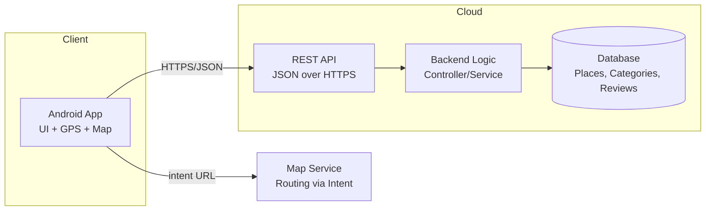
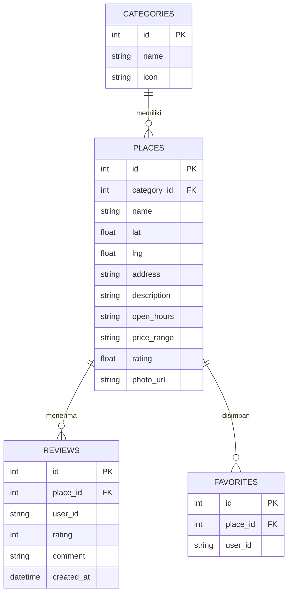
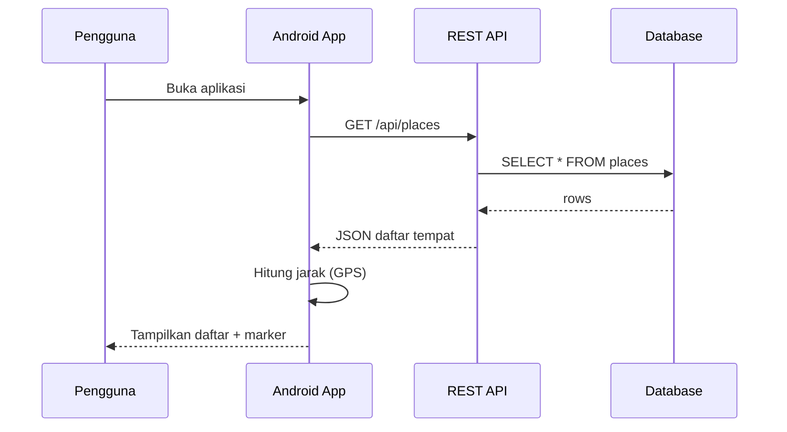
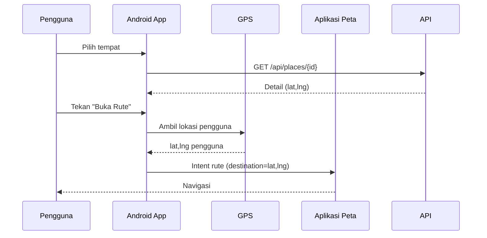
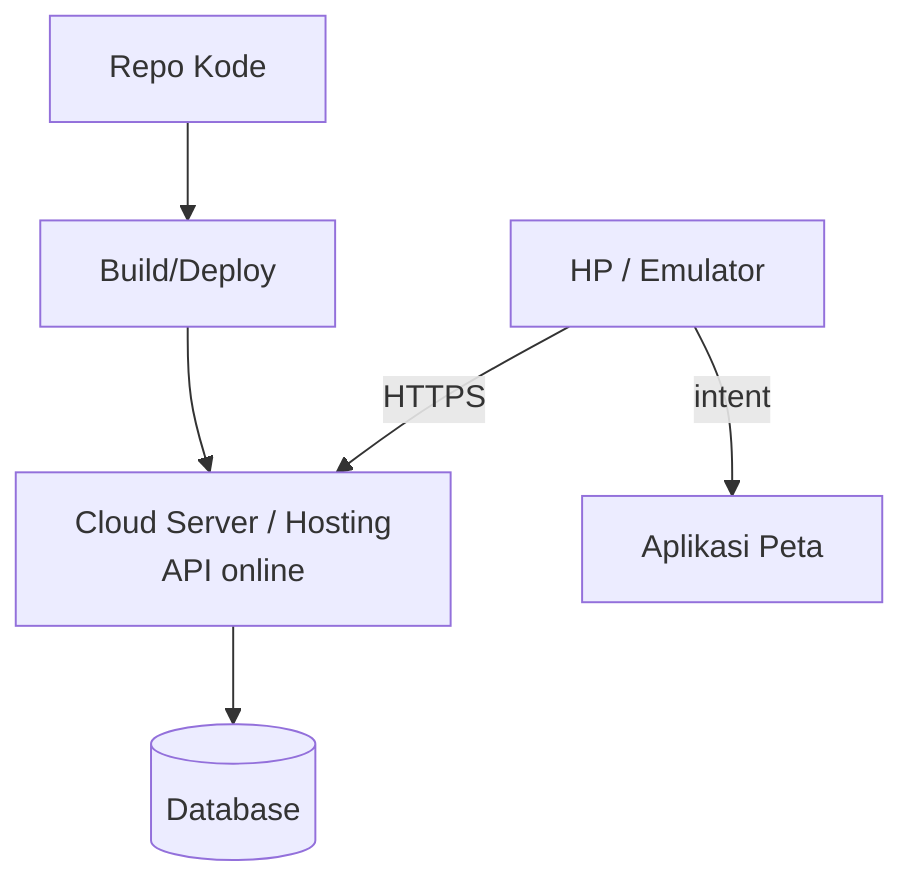

# Software Design Document (SDD)
## Android Map Directory

| | |
|---|---|
| **Produk** | Android Map Directory |
| **Versi** | 1.0 |
| **Tanggal** | Juni 2026 |

---

## 1. Pendahuluan

### 1.1 Tujuan
Dokumen ini menjelaskan rancangan teknis sistem Android Map Directory: arsitektur, desain data, desain API, desain komponen, alur proses (sequence), dan arsitektur deployment. Dokumen dirancang agar dapat dibaca manusia maupun AI Agent untuk implementasi.

### 1.2 Cakupan
Mencakup desain aplikasi Android (client), REST API + cloud server (backend), database, dan integrasi GPS/Map.

---

## 2. Arsitektur Sistem

### 2.1 Gambaran Tingkat Tinggi



### 2.2 Prinsip Desain
- **Pemisahan tanggung jawab:** UI/GPS/Map di client; logika & data di server.
- **Tidak ada akses DB langsung dari Android.** Semua melalui API.
- **Stateless API:** setiap request membawa konteks yang dibutuhkan.
- **Loose coupling:** app, API, dan DB dapat dikembangkan terpisah.

### 2.3 Lapisan Sistem

| Lapisan | Tanggung Jawab |
|---------|----------------|
| Presentation (Android) | UI, peta, marker, GPS, intent rute |
| API (Backend) | Routing endpoint, validasi, serialisasi JSON |
| Business Logic | Pengolahan data, filter, perhitungan |
| Data (Database) | Penyimpanan tempat, kategori, review |

---

## 3. Pilihan Teknologi (Stack)

Pola arsitektur tetap sama meski stack berbeda. Rekomendasi:

| Komponen | Pilihan | Catatan |
|----------|---------|---------|
| Android | Kotlin/Java atau Flutter | Map SDK, permission GPS, list, detail, intent rute |
| Backend API | Node.js/Express, Laravel, CodeIgniter, Flask, atau FastAPI | Endpoint stabil, JSON rapi |
| Database | MySQL, PostgreSQL, Firebase, MongoDB, atau Google Sheet | Minimal tabel tempat & kategori |
| Deployment | VPS, cloud platform, hosting backend, GAS, atau serverless | Backend wajib online |
| Map/Routing | Map SDK + intent ke aplikasi peta | Rute via koordinat tujuan |

---

## 4. Desain Data

### 4.1 Diagram Relasi (ERD)



### 4.2 Kamus Data (Data Dictionary)

**Tabel `categories`**

| Kolom | Tipe | Wajib | Keterangan |
|-------|------|-------|------------|
| id | INT (PK) | Ya | Identitas kategori |
| name | VARCHAR | Ya | Nama kategori (cafe, atm, dll.) |
| icon | VARCHAR | Tidak | Nama/URL ikon |

**Tabel `places`**

| Kolom | Tipe | Wajib | Keterangan |
|-------|------|-------|------------|
| id | INT (PK) | Ya | Identitas tempat |
| category_id | INT (FK) | Ya | Relasi ke categories |
| name | VARCHAR | Ya | Nama tempat |
| lat | DECIMAL | **Ya** | Latitude (inti aplikasi) |
| lng | DECIMAL | **Ya** | Longitude (inti aplikasi) |
| address | VARCHAR | Ya | Alamat |
| description | TEXT | Tidak | Deskripsi singkat |
| open_hours | VARCHAR | Tidak | Jam buka |
| price_range | VARCHAR | Tidak | Kisaran harga |
| rating | DECIMAL | Tidak | Rating rata-rata |
| photo_url | VARCHAR | Tidak | URL foto |

**Tabel `reviews`**

| Kolom | Tipe | Wajib | Keterangan |
|-------|------|-------|------------|
| id | INT (PK) | Ya | Identitas review |
| place_id | INT (FK) | Ya | Relasi ke places |
| user_id | VARCHAR | Ya | Identitas pengguna |
| rating | INT | Ya | Nilai 1–5 |
| comment | TEXT | Tidak | Komentar |
| created_at | DATETIME | Ya | Waktu dibuat |

> **Catatan kritis:** koordinat `lat` & `lng` adalah inti. Tanpa koordinat, data tidak dapat ditampilkan sebagai marker maupun dipakai navigasi.

### 4.3 Contoh DDL (MySQL)

```sql
CREATE TABLE categories (
  id INT AUTO_INCREMENT PRIMARY KEY,
  name VARCHAR(50) NOT NULL,
  icon VARCHAR(100)
);

CREATE TABLE places (
  id INT AUTO_INCREMENT PRIMARY KEY,
  category_id INT NOT NULL,
  name VARCHAR(100) NOT NULL,
  lat DECIMAL(10,7) NOT NULL,
  lng DECIMAL(10,7) NOT NULL,
  address VARCHAR(255),
  description TEXT,
  open_hours VARCHAR(50),
  price_range VARCHAR(50),
  rating DECIMAL(2,1) DEFAULT 0,
  photo_url VARCHAR(255),
  FOREIGN KEY (category_id) REFERENCES categories(id)
);

CREATE TABLE reviews (
  id INT AUTO_INCREMENT PRIMARY KEY,
  place_id INT NOT NULL,
  user_id VARCHAR(64) NOT NULL,
  rating INT NOT NULL,
  comment TEXT,
  created_at DATETIME DEFAULT CURRENT_TIMESTAMP,
  FOREIGN KEY (place_id) REFERENCES places(id)
);
```

---

## 5. Desain API (Backend)

### 5.1 Struktur Lapisan Backend

```
Route  ->  Controller  ->  Service  ->  Repository/Model  ->  Database
```

| Lapisan | Tugas |
|---------|------|
| Route | Memetakan URL ke controller |
| Controller | Validasi request, susun response JSON |
| Service | Logika bisnis (filter, perhitungan) |
| Repository/Model | Query ke database |

### 5.2 Spesifikasi Endpoint

| Method | Endpoint | Param | Response inti |
|--------|----------|-------|---------------|
| GET | `/api/places` | — | array place |
| GET | `/api/places` | `?category=cafe` | array place terfilter |
| GET | `/api/places/{id}` | path `id` | satu place |
| GET | `/api/categories` | — | array category |
| POST | `/api/places` | body JSON | place baru |
| PUT | `/api/places/{id}` | path `id` + body | place diperbarui |
| DELETE | `/api/places/{id}` | path `id` | status hapus |

### 5.3 Aturan Validasi (Backend)
- `name`, `category_id`, `lat`, `lng`, `address` wajib pada create.
- `lat` ∈ [-90, 90], `lng` ∈ [-180, 180].
- `category_id` harus ada di tabel categories.
- Response selalu memiliki field `status` ("success"/"error").

---

## 6. Desain Komponen Android

### 6.1 Struktur Modul (pola MVVM disarankan)

```
app/
 ├─ data/
 │   ├─ remote/        # ApiService (Retrofit/HTTP), DTO
 │   ├─ model/         # Place, Category, Review
 │   └─ repository/    # PlaceRepository
 ├─ domain/
 │   └─ usecase/       # GetPlaces, GetPlaceDetail, CalcDistance
 ├─ ui/
 │   ├─ home/          # HomeScreen + ViewModel
 │   ├─ map/           # MapScreen + ViewModel
 │   ├─ detail/        # DetailScreen + ViewModel
 │   └─ common/        # state loading/error/empty
 └─ util/
     ├─ LocationProvider   # GPS
     └─ MapIntentHelper    # buka rute
```

### 6.2 Tanggung Jawab Komponen Utama

| Komponen | Tanggung jawab |
|----------|----------------|
| ApiService | Memanggil endpoint REST, parsing JSON |
| PlaceRepository | Sumber data tunggal untuk tempat & kategori |
| LocationProvider | Meminta izin & membaca lokasi GPS |
| DistanceCalculator | Hitung jarak (Haversine) lokasi pengguna ↔ tempat |
| MapIntentHelper | Susun URL/intent rute ke aplikasi peta |
| ViewModel | Menyimpan state UI, memanggil repository |

### 6.3 Perhitungan Jarak (Haversine)

```
a = sin²(Δφ/2) + cos φ1 · cos φ2 · sin²(Δλ/2)
c = 2 · atan2(√a, √(1−a))
d = R · c        (R = 6371 km)
```

### 6.4 Membuka Rute via Intent

```
https://www.google.com/maps/dir/?api=1&destination={lat},{lng}
```
atau skema `geo:{lat},{lng}?q={lat},{lng}({name})`. Koordinat tujuan diambil dari data tempat.

---

## 7. Desain Alur Proses (Sequence)

### 7.1 Memuat Daftar Tempat



### 7.2 Buka Rute ke Tempat



---

## 8. Penanganan Error (Desain)

| Kondisi | Deteksi | Perlakuan |
|---------|---------|-----------|
| GPS mati/ditolak | Permission/Location callback | Tampilkan pesan, tetap tampilkan daftar tanpa jarak |
| API gagal (5xx) | HTTP status | Pesan "server bermasalah" + tombol retry |
| Internet putus | Network exception | Pesan "tidak ada koneksi" + retry |
| Data kosong | Response array kosong | Empty state "belum ada tempat" |
| Input admin invalid | Validasi backend (400) | Tampilkan pesan kesalahan field |

---

## 9. Desain Keamanan

| Aspek | Desain |
|-------|--------|
| Credential | Hanya di server (env), tidak di Android |
| Transport | HTTPS saat dipublikasikan |
| Validasi | Backend memvalidasi seluruh input |
| API Key Map | Dibatasi domain/aplikasi |
| Privasi GPS | Lokasi dipakai sementara, tidak disimpan tanpa alasan |

---

## 10. Arsitektur Deployment



| Item | Keterangan |
|------|-----------|
| Backend | Di-deploy ke cloud/VPS/hosting agar dapat dipanggil dari HP |
| Database | Berjalan di server, tidak diakses langsung dari app |
| Base URL | Dikonfigurasi di Android (mis. `https://api.example.com`) |
| Uji akses | Endpoint harus bisa dipanggil dari jaringan luar |

---

## 11. Keputusan Desain (Design Decisions)

| Keputusan | Alasan |
|-----------|--------|
| Tidak akses DB langsung dari Android | Keamanan & kontrol; pola cloud yang benar |
| REST + JSON | Sederhana, didukung semua stack |
| Routing via intent map | Hemat effort, tak perlu engine navigasi sendiri |
| MVVM di Android | Pemisahan UI & logika, mudah diuji |
| Koordinat sebagai field wajib | Tanpa koordinat aplikasi tak berfungsi |
