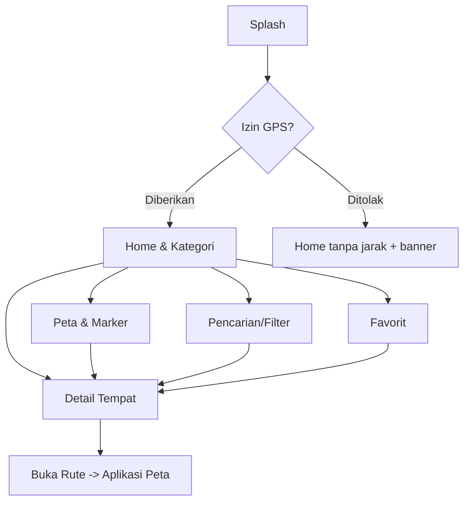
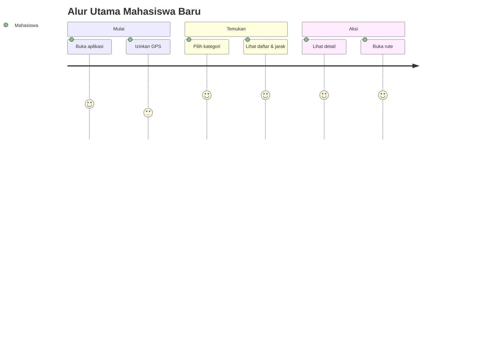

# UI/UX Flow
## Android Map Directory

| | |
|---|---|
| **Produk** | Android Map Directory |
| **Versi** | 1.0 |
| **Tanggal** | Juni 2026 |

---

## 1. Prinsip Desain UX

| Prinsip | Penerapan |
|---------|-----------|
| Cepat ke tujuan | Alur utama (cari → detail → rute) ≤ 5 ketukan |
| Visual jelas | Marker, ikon kategori, jarak ditonjolkan |
| Toleran error | Selalu ada state loading/empty/error + retry |
| Minimal friction | Izin GPS diminta saat dibutuhkan, bukan memaksa |
| Konsisten | Pola kartu tempat sama di semua layar |

---

## 2. Peta Navigasi Aplikasi (App Map)



---

## 3. Alur Pengguna Utama (Happy Path)

```
1. Buka aplikasi (Splash)
2. Izinkan GPS
3. Pilih kategori / cari tempat
4. Lihat daftar + marker di peta
5. Tekan satu tempat -> Detail
6. Tekan "Buka Rute" -> aplikasi peta terbuka
```



---

## 4. Daftar Layar (Screen Inventory)

| # | Layar | Tujuan | Prioritas |
|---|-------|--------|-----------|
| S1 | Splash / Permission | Pembuka + minta izin GPS | Wajib |
| S2 | Home & Kategori | Daftar tempat + filter kategori | Wajib |
| S3 | Peta & Marker | Visual lokasi pada peta | Wajib |
| S4 | Detail & Rute | Info lengkap + tombol rute | Wajib |
| S5 | Pencarian/Filter | Cari kata kunci, urut jarak/rating | Tambahan |
| S6 | Favorit | Tempat tersimpan | Tambahan |
| S7 | Web Admin | Tambah/edit data tempat | Tambahan |

> Tiga layar inti (S2, S3, S4) sudah cukup untuk demo proyek.

---

## 5. Spesifikasi Layar

### S1 — Splash / Permission
- **Konten:** logo, nama aplikasi, prompt izin lokasi.
- **Aksi:** "Izinkan" → Home; "Nanti" → Home tanpa jarak (banner aktifkan GPS).
- **State:** -

### S2 — Home & Kategori
- **Konten:**
  - Search bar di atas.
  - Baris chip kategori (Semua, Cafe, Kantin, Fotokopi, ATM, Parkir, Kos…).
  - Daftar kartu tempat: nama, kategori, jarak (mis. "450 m"), info singkat (Wi-Fi, harga), tombol kecil "Rute".
  - Tombol/tab beralih ke **Peta**.
- **Aksi:** tap kartu → Detail; tap chip → filter; tap "Peta" → S3.
- **State:** loading (skeleton), empty ("belum ada tempat"), error (retry).

```
┌─────────────────────────────┐
│  [🔍 Cari tempat...]        │
│  (Semua)(Cafe)(ATM)(Kantin) │
│ ─────────────────────────── │
│  ☕ Kafe Literasi           │
│  450 m • Wi-Fi • Rp15–30K   │
│                   [ Rute ]  │
│ ─────────────────────────── │
│  🖨 Fotokopi Mawar          │
│  200 m • Buka • Rp/lembar   │
│                   [ Rute ]  │
│ ─────────────────────────── │
│        [ 🗺 Lihat Peta ]    │
└─────────────────────────────┘
```

### S3 — Peta & Marker
- **Konten:**
  - Peta penuh dengan marker tiap tempat.
  - Marker posisi pengguna.
  - Bottom sheet ringkas saat marker ditekan (nama, jarak, "Detail", "Rute").
  - Tombol kembali ke daftar.
- **Aksi:** tap marker → bottom sheet; tap "Detail" → S4; tap "Rute" → aplikasi peta.
- **State:** loading peta, error lokasi (pakai posisi default + banner).

```
┌─────────────────────────────┐
│        🗺  PETA             │
│     📍   📍       📍        │
│         📍  (•) anda        │
│ ─────────────────────────── │
│ ☕ Kafe Literasi  450 m     │
│ [ Detail ]      [ Rute ]    │
└─────────────────────────────┘
```

### S4 — Detail & Rute
- **Konten:**
  - Foto (jika ada), nama, kategori.
  - Jarak, jam buka, kisaran harga, rating.
  - Deskripsi.
  - Mini-map / koordinat.
  - Tombol utama **"Buka Rute"**.
  - (Opsional) tombol favorit & review.
- **Aksi:** "Buka Rute" → intent aplikasi peta dengan koordinat tujuan.
- **State:** loading detail, error (retry).

```
┌─────────────────────────────┐
│ [   foto tempat          ]  │
│ Kafe Literasi   ☕ cafe     │
│ 450 m • Buka 08–22 • ⭐4.5  │
│ Rp15–30K                    │
│ ─────────────────────────── │
│ Deskripsi singkat tempat... │
│ ─────────────────────────── │
│ [ 🧭  BUKA RUTE          ]  │
│ [ ♡ Favorit ] [ ⭐ Review ] │
└─────────────────────────────┘
```

### S5 — Pencarian/Filter (Tambahan)
- Input kata kunci (nama/alamat).
- Filter: kategori, jarak (terdekat), rating tertinggi.
- Hasil memakai kartu yang sama dengan S2.

### S6 — Favorit (Tambahan)
- Daftar tempat yang disimpan pengguna.
- Empty state bila kosong.

### S7 — Web Admin (Tambahan)
- Form: nama, kategori, alamat, latitude, longitude, jam buka, harga, deskripsi, foto.
- Validasi koordinat dan kolom wajib.
- Aksi: simpan (POST), edit (PUT), hapus (DELETE).

---

## 6. State Standar Tiap Layar Data

| State | Tampilan |
|-------|----------|
| Loading | Skeleton/spinner |
| Sukses | Data tampil normal |
| Empty | Ilustrasi + pesan "belum ada data" |
| Error | Pesan + tombol "Coba lagi" |
| Tanpa GPS | Banner "Aktifkan lokasi untuk jarak & rute" |

---

## 7. Pola Interaksi & Komponen

| Komponen | Perilaku |
|----------|----------|
| Kartu tempat | Tap → detail; tombol rute langsung |
| Chip kategori | Toggle filter, satu aktif |
| Marker | Tap → bottom sheet ringkas |
| Tombol "Buka Rute" | Memicu intent ke aplikasi peta |
| Search bar | Debounce input, hasil real-time |
| Pull-to-refresh | Muat ulang daftar dari API |

---

## 8. Pertimbangan Aksesibilitas & Kualitas
- Kontras teks cukup, ukuran sentuh ≥ 48dp.
- Label ikon kategori jelas (tidak hanya warna).
- Pesan error memakai bahasa sederhana dan menyarankan tindakan.
- Hindari menahan pengguna saat izin GPS ditolak — tetap izinkan jelajah daftar.

---

## 9. Pemetaan Layar ↔ Endpoint API

| Layar | Endpoint dipakai |
|-------|------------------|
| S2 Home | `GET /api/places`, `GET /api/categories` |
| S2 (filter chip) | `GET /api/places?category={cat}` |
| S3 Peta | `GET /api/places` (koordinat) |
| S4 Detail | `GET /api/places/{id}` |
| S5 Pencarian | `GET /api/places?category=...` + filter klien |
| S7 Admin | `POST/PUT/DELETE /api/places` |
